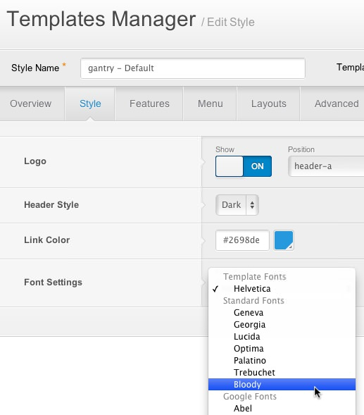
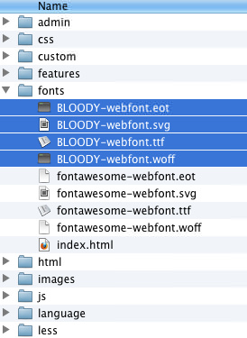
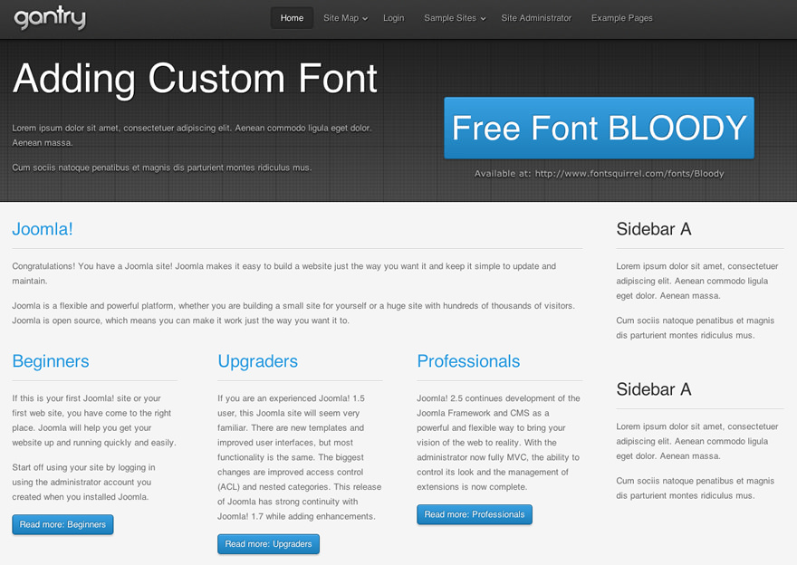

This tutorial will take you through the steps needed to add a custom font to your Gantry template and make it available on the Font Settings dropdown in the template parameters.

In this example, we will explain how you can add the custom free font **Bloody** to your Gantry template.




Step 1: Adding Your Custom Font Files
--------------------------------------
**Bloody** is a free font that you can download at [FontSquirrel](http://www.fontsquirrel.com/fonts/Bloody). Please ensure you download the **@font-face Kit**.

Unzip the package and move the following files to `/templates/[TEMPLATE]/fonts/`:

* BLOODY-webfont.eot
* BLOODY-webfont.svg
* BLOODY-webfont.ttf
* BLOODY-webfont.woff




Step 2: Adding the Necessary CSS
--------------------------------
[Create your custom stylesheet file](custom_stylesheet.md), __gantry-custom.css__, and add it to `/templates/[TEMPLATE]/css/`. Add the following to the custom CSS file.

```css
/* Adding Font BLOODY */

@font-face {
    font-family: 'BloodyNormal';
    src: url('../fonts/BLOODY-webfont.eot');
    src: url('../fonts/BLOODY-webfont.eot?#iefix') format('embedded-opentype'),
         url('../fonts/BLOODY-webfont.woff') format('woff'),
         url('../fonts/BLOODY-webfont.ttf') format('truetype'),
         url('../fonts/BLOODY-webfont.svg#BloodyNormal') format('svg');
}

.font-family-bloody {
  font-family: 'BloodyNormal',Helvetica,Arial,sans-serif;
  font-weight: normal;
  font-style: normal;
}
```


Step 3: Adding the Info to the Font Settings Dropdown
-----------------------------------------------------
With your text/code editor, open `/templates/[TEMPLATE]template-options.xml` and add the custom font option (line 9 in the below example):

```xml
<field name='family' type='fonts' default='s:helvetica' primary='helvetica' label='FONT_FAMILY' isbodyclass='true' setbyurl='true' setinsession='true' setbysession='true' setincookie='true' setbycookie='true'>
    <option value='geneva'>Geneva</option>
    <option value='georgia'>Georgia</option>
    <option value='helvetica'>Helvetica</option>
    <option value='lucida'>Lucida</option>
    <option value='optima'>Optima</option>
    <option value='palatino'>Palatino</option>
    <option value='trebuchet'>Trebuchet</option>
    <option value='bloody'>Bloody</option>
</field>
```

Go to your template manager and confirm that the new font option is available.


The Gantry template default font is **Helvetica** and the frontend will look like this:



Now, set the default font to **Bloody** in the Font Settings parameter and reload the front end to check the result.


You can add as many custom fonts as you wish, and set the multiple option in the font settings.


Font Usage on Specific Elements
-------------------------------
In addition to adding the **Bloody** font, as outlined above, you can also add it to specific elements like component title and module title. In this example, we add the following to the custom CSS file mentioned above:

```css
/* Adding Font BLOODY */

@font-face {
    font-family: 'BloodyNormal';
    src: url('../fonts/BLOODY-webfont.eot');
    src: url('../fonts/BLOODY-webfont.eot?#iefix') format('embedded-opentype'),
         url('../fonts/BLOODY-webfont.woff') format('woff'),
         url('../fonts/BLOODY-webfont.ttf') format('truetype'),
         url('../fonts/BLOODY-webfont.svg#BloodyNormal') format('svg');
}

.font-family-bloody .title, .font-family-bloody .component-content h2{
  font-family: 'BloodyNormal',Helvetica,Arial,sans-serif;
  font-weight: normal;
  font-style: normal;
}
```

Reload the front end and check the result. Only the component title and module title will use the `Bloody` font. The rest of the content will use the default font `Helvetica`.


