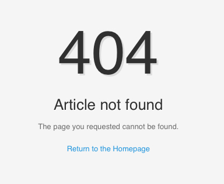

[ui-tabs position="top-left" active="0"]
[ui-tab title="Joomla"]

Joomla comes with a default 404 Error Page which Gantry can override at `/templates/[TEMPLATE]/error.php`.

  {.border .shadow}

We can customize the Gantry error page by directly editing the `error.php` file. In this tutorial, we will explain how to customize the error page with a simple design.

In this example, we will customize the error page to look like the following.

  {.border .shadow}

[/ui-tab]
[ui-tab title="WordPress"]

WordPress doesn't come with a default **404 Error Page**. We can, however, create one at `/wp-content/themes/[TEMPLATE]/404.php`.

We can customize the Gantry error page by directly editing the `404.php` file. In this tutorial we will explain how to build a custom error page with a simple design.

In this example, we will create a custom error page with this design:

  {.border .shadow}

[/ui-tab]
[/ui-tabs]

Step 1: Edit the Error Page
---------------------------

[ui-tabs position="top-left" active="0"]
[ui-tab title="Joomla"]

Edit the `rt-error-body` area in `/templates/[TEMPLATE]/error.php` to reflect the following.

```html
<div id="rt-error-body">
  <div class="rt-container">
    <div class="component-content">
      <div class="rt-grid-12">
        <div class="rt-block">
          <div class="rt-error-box custom-404">
            <div>
            <h1 class="error-title title"><?php echo $this->error->getCode(); ?></h1>
            <h2 class="error-message"><?php echo $this->error->getMessage(); ?></h2>
            <div class="error-content">
            <p>The page you requested cannot be found.</p>
            <p><a href="<?php echo $gantry->baseUrl; ?>"><span>Return to the Homepage</span></a></p>
            </div>
          </div>
        </div>
      </div>
    </div>
  </div>
</div>
```

[/ui-tab]
[ui-tab title="WordPress"]

Edit the `rt-error-body` area in `/wp-content/themes/[TEMPLATE]/404.php` to reflect the following:

```html
<div id="rt-error-body">
  <div class="rt-container">
    <div class="component-content">
      <div class="rt-grid-12">
        <div class="rt-block">
          <div class="rt-error-box custom-404">
            <div>
            <h1 class="error-title title">404</h1>
            <h2 class="error-message">Page not found</h2>
            <div class="error-content">
            <p>The page you requested cannot be found.</p>
            <p><a href="<?php echo site_url(); ?>"><span>Return to the Homepage</span></a></p>
            </div>
          </div>
        </div>
      </div>
    </div>
  </div>
</div>
```

[/ui-tab]
[/ui-tabs]

Step 2: Adding Custom CSS
-------------------------

[ui-tabs position="top-left" active="0"]
[ui-tab title="Joomla"]

[Add a custom css file](../adding-a-custom-stylesheet) for styling our custom error page, and load it by adding the stylesheet link declaration in `error.php`.

```html
<!DOCTYPE html PUBLIC "-//W3C//DTD XHTML 1.0 Transitional//EN" "http://www.w3.org/TR/xhtml1/DTD/xhtml1-transitional.dtd">
<html xmlns="http://www.w3.org/1999/xhtml" xml:lang="<?php echo $this->language; ?>" lang="<?php echo $this->language; ?>" dir="<?php echo $this->direction; ?>">
<head>

<title><?php echo $this->error->getCode(); ?> - <?php echo $this->title; ?></title>
<link rel="stylesheet" href="<?php echo $this->baseurl; ?>/templates/<?php echo $this->template; ?>/css/gantry-compiled.css" type="text/css" />
<link rel="stylesheet" href="<?php echo $this->baseurl; ?>/templates/<?php echo $this->template; ?>/css/fusionmenu.css" type="text/css" />
<link rel="stylesheet" href="<?php echo $this->baseurl; ?>/templates/<?php echo $this->template; ?>/css/typography.css" type="text/css" />
<link rel="stylesheet" href="<?php echo $this->baseurl; ?>/templates/<?php echo $this->template; ?>/css/font-awesome.css" type="text/css" />

<!-- Adding Custom CSS -->
<link rel="stylesheet" href="<?php echo $this->baseurl; ?>/templates/<?php echo $this->template; ?>/css/gantry-custom.css" type="text/css" />
```

Next, you will need to add the following rules and properties to your custom stylesheet, `gantry-custom.css`.

```css
/* Custom Error */
.custom-404 {text-align: center;}
.custom-404 h1, .custom-404 h2 {border: none; box-shadow: none; margin: 0; padding: 0;}
.custom-404 h1 {font-size: 8.0em; text-shadow: 3px 3px 0 rgba(0, 0, 0, 0.1);}
.custom-404 h2 {font-size: 2.0em; line-height: 2.0em;}
```

[/ui-tab]
[ui-tab title="WordPress"]

[Add a custom css file](../adding-a-custom-stylesheet) for styling our custom error page, and load it by adding the stylesheet link declaration in `404.php`.

```html
<!DOCTYPE html PUBLIC "-//W3C//DTD XHTML 1.0 Transitional//EN" "http://www.w3.org/TR/xhtml1/DTD/xhtml1-transitional.dtd">
<html xmlns="http://www.w3.org/1999/xhtml" xml:lang="<?php echo $this->language; ?>" lang="<?php echo $this->language; ?>" dir="<?php echo $this->direction; ?>">
<head>

<title>404 - <?php echo $this->title; ?></title>
<link rel="stylesheet" href="<?php echo get_template_directory_uri(); ?>/css/gantry-compiled.css" type="text/css" />
<link rel="stylesheet" href="<?php echo get_template_directory_uri(); ?>/css/fusionmenu.css" type="text/css" />
<link rel="stylesheet" href="<?php echo get_template_directory_uri(); ?>/css/typography.css" type="text/css" />
<link rel="stylesheet" href="<?php echo get_template_directory_uri(); ?>/css/font-awesome.css" type="text/css" />

<!-- Adding Custom CSS -->
<link rel="stylesheet" href="<?php echo get_template_directory_uri(); ?>/css/gantry-custom.css" type="text/css" />
```

Next, you will need to add the following rules and properties to your custom stylesheet, `gantry-custom.css`.

```css
/* Custom Error */
.custom-404 {text-align: center;}
.custom-404 h1, .custom-404 h2 {border: none; box-shadow: none; margin: 0; padding: 0;}
.custom-404 h1 {font-size: 8.0em; text-shadow: 3px 3px 0 rgba(0, 0, 0, 0.1);}
.custom-404 h2 {font-size: 2.0em; line-height: 2.0em;}
```

[/ui-tab]
[/ui-tabs]

That's it! You should now have a custom error page live on your site.

